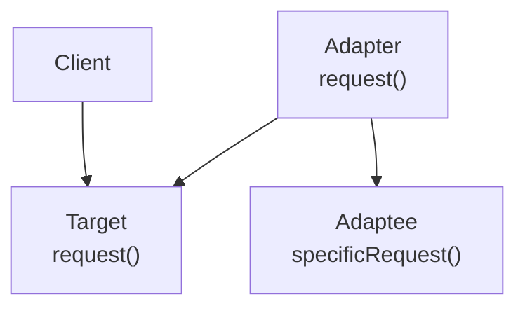
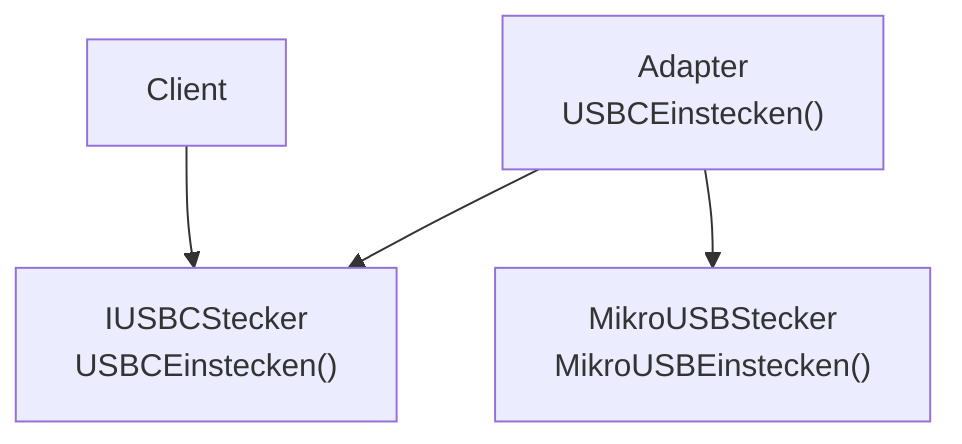
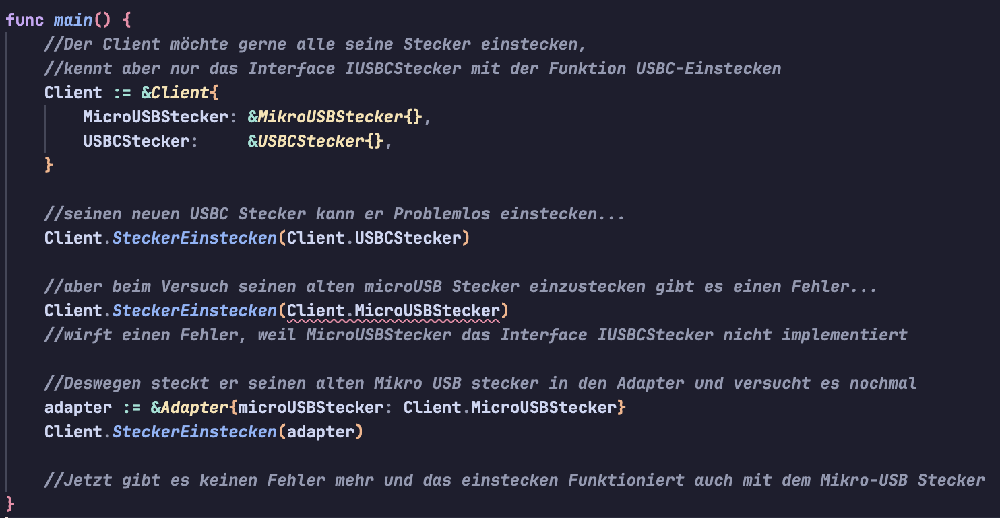

# Adapter Pattern

## Steckbrief

**Name:** Adapter (auch Hüllenklasse oder Wrapper)  
**Art:** Strukturmuster 
**Klassifikation:** klassen- oder objektbasiertes Strukturmuster 
**Zweck:** Dient dazu zwei inkompatible Schnittstellen zu Verbinden 
**Hauptkomponenten:**

- Target: Das ist die Client-Schnittstelle, die vom Client verwendet wird und die dieser erwartet.
- Client: Eine Klasse, die mit Objekten interagiert, welche die Client-Schnittstelle implementieren.
- Adapter: Implementiert die Client-Schnittstelle und hält intern eine Referenz auf das Adaptee-Objekt. "Übersetzt" die Aufrufe vom Client an den Adaptee.
- Adaptee: Besitzt die Funktionalität, hat aber eine zum Client inkompatible Schnittstelle (specificRequest()).

**Struktur:**

-> Der Client kann den Adaptee verwenden obwohl er nur die Schnittstelle aufruft, die er kennt

## Vorteile & Nachteile

| Pro|Con|
|--|--|
|Ermöglicht die Wiederververwendbarkeit von Code trotz fehlender Kompatibilität |Kann bei wenigen oder kleinen Schnittstellen schnell unnötige Komplexität hinzufügen|
| Die Logik zur "Übersetzung" der Schnittstellen ist sauber im Adapter gekapselt. Client und Adaptee bleiben unverändert. |Ineffizienter durch eine dritte Instanz in der Mitte|
|Ein Adapter kann auch mehrere Adaptees kapseln oder zusätzliche Funktionalität hinzufügen.

## Einsatzgebiete

- Einbindung von nicht direkt kompatiblen Bibliotheken
- Einbindung von alten, nicht mehr kompatiblen Systemteilen (z.B. alter Code)

## Warum existiert das Pattern
Ohne das Pattern müsste man entweder:
- Den Client umschreiben: Der Code des neuen Systems müsste an die Schnittstelle angepasst werden. Dadurch könnte der Client z.B. die Möglichkeit verlieren, mit zuvor kompatiblen Schnittstellen zu kommunizieren. 
- Den Adaptee umschreiben: Das ist teilwese unmöglich wie z.B. bei externen Bibliotheken, bzw. hoher Aufwand, da alter Code verändert werden muss. 

## Codebeispiel

- kann in der main.go über `go run main.go` ausgeführt werden.
- Pattern Struktur auf unser Codebeispiel angewendet:

\

